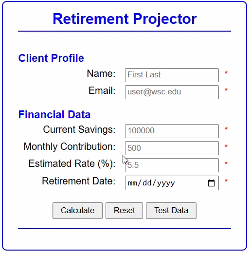
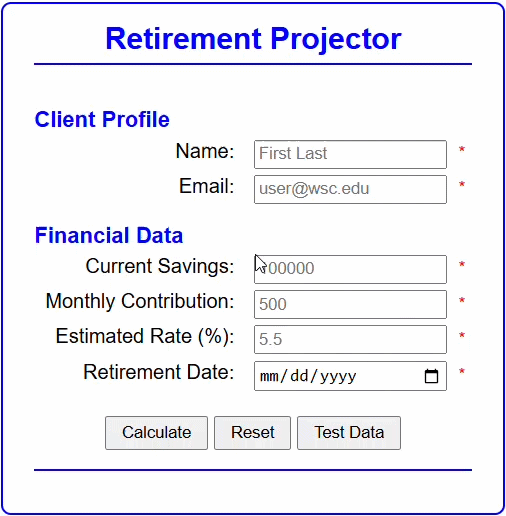
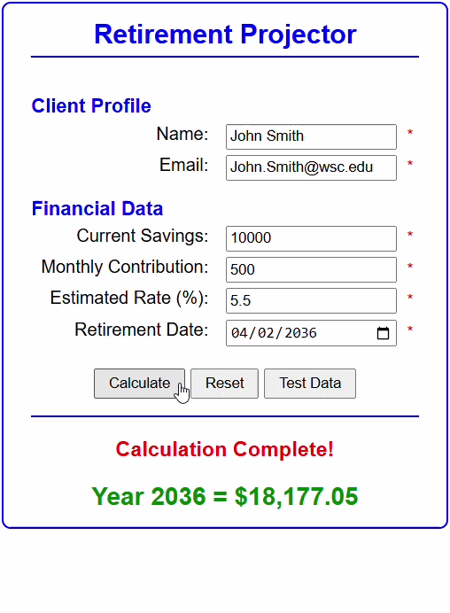

# 🧮Program Description    
> *Essentially, this program is a future value calculator that performs calculations using the data that is inserted by the user. It also serves as retirement countdown counter that takes your retirement date and counts how many years are left before then. The output box centered at the bottom outputs a "live projection" that updates every second, showing how your money grows over each year.*

# 📕Table of Contents
* [Program Description](#program-description-)
* [Required Inputs](#required-inputs)
* [New Concepts Learned](#new-concepts-learned-developing-this-program)
* [Button Descriptions](#-button-descriptions)
* [Authors](#authors)

# 💻Required Inputs:
Field | What is it?
------------- | -------------
Name | User's Name
Email | User's Email
Current Savings💲| Current balance of savings
Monthly Contribution | Monthly deposit or withdrawal from retirement plan
Estimated Rate (%): | Rate of growth 
Retirement Date | Planned retirement date

# 🏫New Concepts Learned Developing This Program:
```We learned how to work with Dates, Times, and Timers. For example:```
> - We learned how to create a date Label for HTML file.
> - We learned how to create a *Date()* object. For example: _*const now = new Date()*_;
> - We learned how to validate the user's date input.
> - We learned how to do math with dates.
> - We learned various get methods for a *Date()* object.
> - We learned a great way to test our program with a button that quickly fills fields. More below!

#  Button Descriptions:
The __"Test Data"__ button:<br>
>*Essentially, all this button does is enter data. This was primarily coded into the program so that the software developer didn't have to enter test data over and over again for testing purposes.* <br>
Take a look!👀 <br>


The __"Reset"__ button:<br>
>*The purpose of this button is to clear every field of the form. It's a quality of life button! This is very useful when you want to make another future value projection. That way you don't have to clear every field manually!* <br>
Take a look!👀 <br>


The __"Calculate"__ button:<br>
>*The purpose of this button is to run the calculations! It displays the information of the live projection!* <br>
Take a look!👀 <br>


# 🧑‍🎓Authors
Ethan McEvoy
> - GitHub URL: https://github.com/EMcE01
> - Email: etmcev01@wsc.edu

Rafael Negrete Fonseca
> - GitHub URL: https://github.com/rnegrete01
> - Email: ranegr01@wsc.edu or rafaelnegretefonseca123@gmail.com


